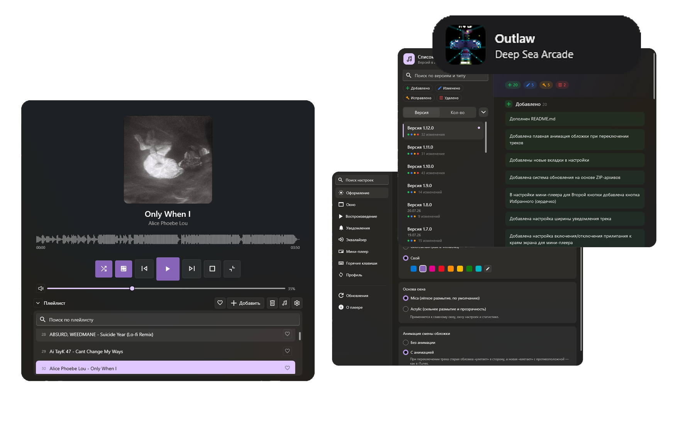

# Lumisense

[](https://github.com/wasssly/Lumisense/releases) [](https://github.com/wasssly/Lumisense/actions/workflows/release.yml) [](https://github.com/wasssly/Lumisense)



**Lumisense** — локальный аудиоплеер для Windows 11 в стиле Fluent Design. Он воспроизводит музыку с диска без стриминга и облачных сервисов, поддерживает обложки, теги, плейлисты, эквалайзер, статистику прослушиваний, мини-плеер и обновление через GitHub Releases.

Проект рассчитан прежде всего на Windows 11 и использует Mica/Acrylic, скруглённые элементы, собственный заголовок окна, тёмную и светлую темы, а также три режима интерфейса: обычное окно, квадратный вид с крупной обложкой и компактный мини-плеер.

> **Дисклеймер.** Lumisense в значительной степени создавался с помощью **Claude** и **Manus AI** и первоначально разрабатывался для личного использования — под конкретные привычки и предпочтения автора, а не как универсальный продукт для всех. Поэтому отдельные решения могут быть субъективными, а некоторые функции — ещё требовать доработки. Если вы нашли ошибку, столкнулись с неудобством или считаете, что проекту не хватает важной возможности, пожалуйста, создайте [issue](https://github.com/wasssly/Lumisense/issues).

## Возможности

### Воспроизведение и звук

- Воспроизведение MP3, WAV, WMA, FLAC, M4A, AAC, OGG и других поддерживаемых NAudio форматов.
- Play/pause/stop, переход между треками, перемотка по прогресс-бару и автоматический переход к следующей композиции.
- Регулировка громкости, включая плавную логарифмическую регулировку в нижнем диапазоне.
- Десятиполосный эквалайзер с пресетами от 31 Гц до 16 кГц. Пользовательские пресеты можно сохранять, экспортировать и импортировать.
- Шафл и три режима повтора: без повтора, повтор плейлиста и повтор одного трека.

### Плейлист и медиатека

- Добавление отдельных файлов, папок с подпапками и пустых папок для последующего наполнения.
- Группировка треков по папкам, сворачивание и разворачивание групп, включение и отключение отдельных групп в воспроизведении.
- Проверка добавленных папок на новые файлы и поиск по плейлисту.
- Виртуализированный список, рассчитанный на работу с большими плейлистами.
- Избранное с отдельным виртуальным представлением и быстрым переключением из заголовка плейлиста.
- Редактирование тегов и свойств трека прямо из приложения.

### Интерфейс и интеграция с Windows

- Обычный, квадратный и компактный режим мини-плеера.
- Мини-плеер поверх других окон, настройка прозрачности, перемещение с привязкой к краям экрана и фон, адаптирующийся к текущей обложке.
- Тёмная и светлая темы, системный или пользовательский акцентный цвет, Mica/Acrylic и дополнительные параметры внешнего вида.
- Медиа-клавиши Windows, пользовательские горячие клавиши, значок в системном трее и Now Playing через System Media Transport Controls.
- Всплывающее уведомление о смене трека.
- Автозапуск вместе с Windows, запуск свёрнутым в трей, сворачивание в трей вместо закрытия и создание ярлыка на рабочем столе.

### Метаданные и история

- Чтение обложек из тегов, поиск обложек в интернете и ручная установка изображения.
- Просмотр и редактирование свойств обложки.
- Статистика прослушиваний со счётчиком для каждого трека и отдельным окном сводки.
- Экспорт и импорт настроек в один `.lumi`-файл.
- Список изменений внутри приложения с поиском, сортировкой, визуальными категориями и автоматическим расчётом версии по SemVer.
- Проверка обновлений через GitHub Releases и установка новой версии из приложения.

## Требования

Для запуска из исходников потребуется Windows 10 или Windows 11 с поддержкой WPF и .NET 8. Для разработки можно использовать Visual Studio 2022 версии 17.8 или новее с workload **.NET desktop development**, либо установленный **.NET 8 SDK**.

## Запуск из исходников

1. Клонируйте репозиторий:

   ```powershell
   git clone https://github.com/wasssly/Lumisense.git
   cd Lumisense/Lumisense
   ```

2. Восстановите зависимости и запустите проект:

   ```powershell
   dotnet restore
   dotnet run
   ```

Также можно открыть `Lumisense.csproj` в Visual Studio и запустить приложение клавишей **F5**. При первом восстановлении NuGet автоматически загрузит необходимые пакеты.

## Готовые сборки и обновления

Готовые установщики `Lumisense_Setup.exe` публикуются на странице [Releases](https://github.com/wasssly/Lumisense/releases) при создании тегов формата `v*.*.*`. Сборка выполняется автоматически через [GitHub Actions](https://github.com/wasssly/Lumisense/actions) с использованием self-contained `dotnet publish` и Inno Setup из `Installer/Lumisense.iss`.

Сам плеер умеет проверять наличие новых версий через GitHub Releases и подсказывать пользователю об обновлении. Исходный код приложения и установщик распространяются отдельно: перед использованием конкретной сборки ознакомьтесь с описанием соответствующего релиза.

## Технологический стек

- **.NET 8** и WPF (`net8.0-windows10.0.19041.0`).
- **[WPF-UI](https://github.com/lepoco/wpfui)** — Fluent-компоненты, `FluentWindow`, Mica-фон и системные элементы интерфейса.
- **[NAudio](https://github.com/naudio/NAudio)** — декодирование и воспроизведение аудио.
- **[TagLibSharp](https://github.com/mono/taglib-sharp)** — чтение и запись тегов и обложек.
- **[SharpVectors](https://github.com/ElinamLLC/SharpVectors)** — отображение SVG-иконок интерфейса.
- **Windows Forms** — системный трей и `NotifyIcon`.

## Структура репозитория

```text
Lumisense/
├── .github/workflows/release.yml       — сборка и публикация релизов по тегу
├── Installer/Lumisense.iss             — сценарий установщика Inno Setup
└── Lumisense/                          — исходный код плеера
    ├── Lumisense.csproj
    ├── App.xaml / .cs                   — точка входа и подключение тем
    ├── MainWindow.xaml / .cs            — основное окно и воспроизведение
    ├── MiniPlayerWindow.xaml / .cs      — компактный мини-плеер
    ├── AppSettings.cs                   — настройки и сохранение состояния
    ├── PlaylistFolder.cs / Favorites.cs — плейлист и избранное
    ├── EqualizerSampleProvider.cs       — десятиполосный эквалайзер
    ├── CoverArt*.xaml(.cs)              — работа с обложками
    ├── Track*.xaml(.cs)                 — свойства и теги треков
    ├── StatisticsWindow.xaml(.cs)       — статистика прослушиваний
    ├── LumiProfile.cs                   — экспорт и импорт профилей
    ├── SettingsWindow.xaml / .cs        — окно настроек
    ├── Changelog/                       — история изменений
    ├── TrayIconManager.cs               — системный трей
    ├── GlobalMediaHotKeys.cs            — медиа-клавиши и горячие клавиши
    ├── NowPlayingIntegration.cs         — интеграция Now Playing
    ├── UpdateChecker.cs                 — проверка обновлений
    └── Icons/                           — SVG-иконки и иконка приложения
```

## Обратная связь

Если вы нашли ошибку или хотите предложить улучшение, создайте [issue в репозитории](https://github.com/wasssly/Lumisense/issues). В описании желательно указать версию приложения, шаги воспроизведения проблемы и, если возможно, фрагмент лога или скриншот.

## Лицензия

Информация о лицензии будет добавлена в репозиторий отдельно. До её публикации ознакомьтесь с условиями использования исходного кода и сторонних зависимостей, перечисленных в разделе [«Технологический стек»](#технологический-стек).
